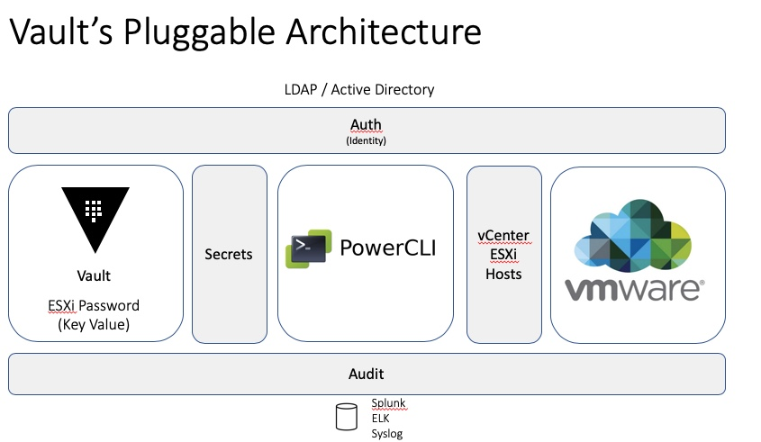
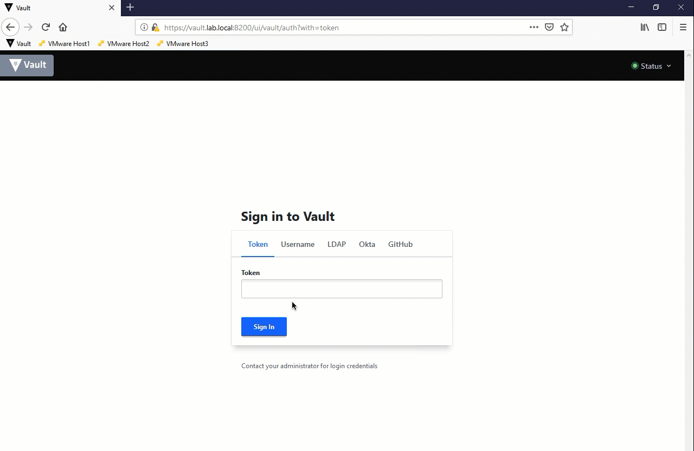
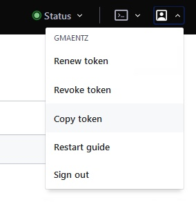
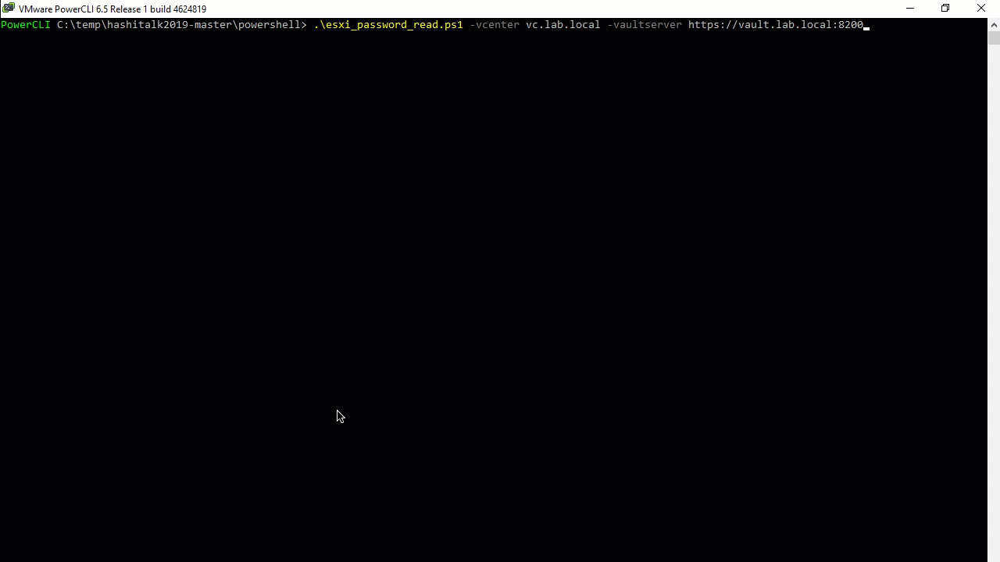

# Managing VMware Environments with HashiCorp Vault

VMware is the virtualization standard within the corporate datacenter. An all too common practice is to use common passwords for the most privileged accounts within VMware environments. How many VM admins utilize the same root password for all of their ESXi servers? When was the last time your root password for ESXi servers was changed?
There has to be a better way.

In this talk we will showcase the evolution of managing VMware credentials.  The goal will be to demonstrate how HashiCorp Vault can be used to help VMware Admins move to short-lived, dynamic credentials within ESXi and vSphere environments. Join us to learn: 

* How to use dynamic credentials within your VMware environment.
* How VMware Admins can utilize existing tools like PowerCLI with HashiCorp Vault. 
* Ways you can use HashiCorp Vault to manage, control and rotate VMWare credentials in an automated manner.

## VMware, PowerCLI and HashiCorp Vault




* Discovery of ESXi hosts using PowerCLI
* Pull root password for each ESXi host using Vault REST API
* Generate unique passwords per host and update Vault
* Version Passwords within Vault

## Prerequisites / Vault Setup
* HashiCorp Vault cluster that is reachable via PowerCLI. (Inbound TCP port 8200 to Vault)

### Step 1: Configure Policies
Create Vault policy for 'vmadmins' with ACL settings specifed via [vmadmins.hcl](policies/vmadmins.hcl) via the Vault UI

*Picture?*

Alternatively this can be done via the Vault CLI
```
vault policy write vmadmins policies/vmadmins.hcl
```
### Step 2: Associate the vmadmins policy with the LDAP Group or user pass
Associate the VMware Admins Active Directory group with the Vault vmadmins policy.
```
vault write "auth/ldap/groups/VMware Admins" policies=vmadmins
```
If you are not using LDAP authentication withn Vault you can us an alternative authentication method.  Below is an example associating username password authentication to the Vault vmadmins policy
```
vault write auth/userpass/users/vmadmin password={Your_Password} policies=vmadmins
```
### Step 3: Enable the KV secrets engine and store ESXi passwords per host
* A version 2 K/V secrets backend mounted at `systemcreds`
* Passwords are stored under the Vault path: /systemcreds/esxihosts/$vmhost

Ex.


### Step 4: Login as the User and Generate a Token
Login to the UI copy the token.



Alternatively this can be done via the Vault CLI
```
vault token create -period 24h -policy vmadmins
```

### Step 5: Update ESXi passwords using PowerCLI and Vault
Utilize [esxi_password_update.ps1](powershell/esxi_password_update.ps1) to read the existing root password from Vault, connect to vCenter, loop through all hosts connected with vCenter, generate a random password and set it for each host, and record the new password with Vault - keeping a versioned history.

```powershell
.\esxi_password_update.ps1 -vcenter {vcenter} -vaultserver {vault server -vaulttoken {vaulttoken}
```
Example:
```powershell
.\esxi_password_update.ps1 -vcenter vc.lab.local -vaultserver https://vault.lab.local:8200
```


***

### Optional: Run the read password script to list root passwords stored in Vault
Utilize [esxi_password_read.ps1 PowerCLI script](powershell/esxi_password_read.ps1) to read the existing root password for all hosts in Vault.

Example:
```powershell
.\esxi_password_read.ps1 -vcenter vc.lab.local -vaultserver https://vault.lab.local:8200
```



## Manual and Semi-Automated Alternatives:
Below are some of the manual and partially automated options for rotating ESXi root passwords:

### Manual password updates with Web Interface and/or PowerCLI


#### PowerCLI
Changing an ESXi root password manually via PowerCLI.
```powershell
$CurrentPassword = "VMware1!"
$NewPassword = "NewP@ssw0rd"
Connect-VIServer host1.lab.local -User root -Password $CurrentPassword
Set-VMHostAccount -UserAccount root -Password $NewPassword
Disconnect-VIServer host1.lab.local -Confirm:$False
```
***

### Host Profiles

Changing an ESXi root password manually using Host Profiles.


*Note: Host Profiles are currently licesened to VMware Enterprise Plus customers only *

***

### Batch password update across ESXi hosts using PowerCLI
Changing the ESXi root password of all hosts via PowerCLI.

Utilize [esxi_password_batch_update.ps1 PowerCLI script](powershell/esxi_password_batch_update.ps1) to perform a batch update against all hosts within vCenter.


***


